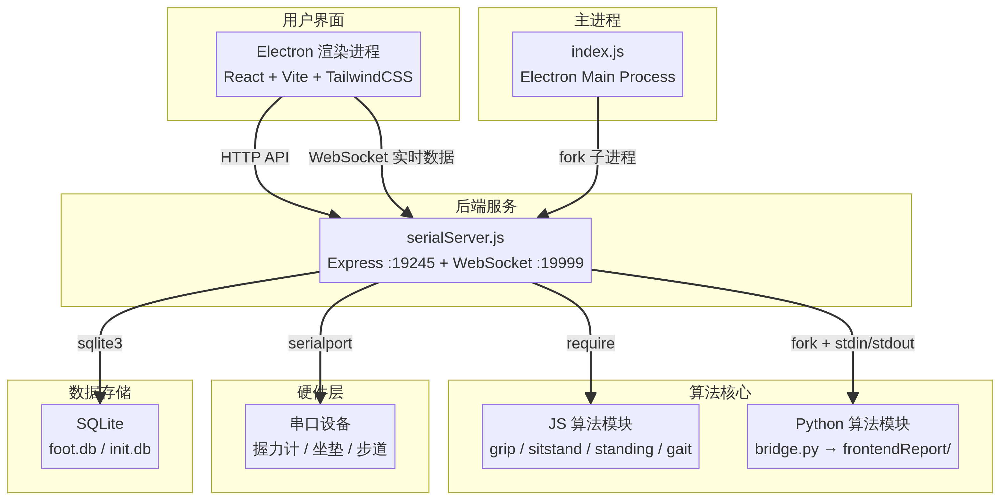

# 老年人筛查系统MAC 架构文档

**版本**: 2.0
**最后更新**: 2026-04-29 04:15
**作者**: Manus AI

## 更新日志
| 日期 | 分支 | 类型 | 描述 |
|---|---|---|---|
| 2026-04-29 04:15 | ld | 修复缺陷 | 修复设备已连接但状态栏绿灯显示灰色的问题。在 `Dashboard.jsx` 挂载时重置后端推送模式为全部设备（`setActiveMode(null)`），确保从单设备评估页面返回主页后，后端能够继续推送所有已连接设备的状态。同时调整静态站立评估的脚垫滤波默认值：`filterThreshold` 改为 10，`filterMinArea` 改为 8。修改文件：`front-end/src/pages/Dashboard.jsx`、`back-end/code/server/serialServer.js`、`front-end/src/pages/assessment/StandingAssessment.jsx`。 |
| 2026-04-29 00:05 | ld | 修复缺陷 | 解决打包更新后用户配置数据（设备MAC映射、机构名称、大模型API-key）被覆盖的问题。将 `serialPathCandidates` 简化为打包后仅使用 `userData` 目录读取和写入，移除安装目录的读写，避免更新时文件被新包替换。同时增强 `ensureSeedFile` 逻辑并添加 `init.db` 的种子复制。修改文件：`back-end/code/server/serialServer.js`。 |
| 2026-04-15 17:10 | main | 配置变更 | 修复 Electron 自动更新元数据未生成的问题。恢复 `back-end/code/package.json` 中 `electron-builder` 的 `build.publish` generic 配置，使 Windows 构建重新产出 `dist/latest.yml`；同步将 `back-end/code/dev-app-update.yml` 更新到 `http://sensor.bodyta.com/shroom1`，并重写 `back-end/code/scripts/inject-release-notes.js`，按实际构建产物识别平台，仅在对应 yml 存在时注入 release notes，并在缺少更新元数据时输出明确提示。 |
| 2026-04-15 10:30 | main | 新增功能 | 完善版本管理和自动更新流程。新增 `release-notes/` 目录结构（windows/mac 分平台存放版本更新说明）；新增 `inject-release-notes.js` 打包后自动将 release-notes 注入 `latest.yml` 的 `releaseNotes` 字段；更新服务器地址改为 `http://sensor.bodyta.com/shroom1`；前端新增 `VersionHistory.jsx`（紫色历史按钮 + 弹窗展示硬编码版本记录）；`UpdateNotification.jsx` 改造为右下角更新按钮 + 弹窗显示服务器 `releaseNotes`；Login.jsx 去掉检查更新按钮。修改文件：`back-end/code/updater.js`、`back-end/code/package.json`、`back-end/code/scripts/inject-release-notes.js`、`back-end/code/release-notes/`、`front-end/src/components/ui/UpdateNotification.jsx`、`front-end/src/components/ui/VersionHistory.jsx`、`front-end/src/App.jsx`、`front-end/src/pages/Login.jsx`。 |
| 2026-04-14 | main | 配置变更 | 调整 Windows 打包链路为“完整 Python runtime 随包携带”。构建前新增 `prepare-python-runtime.js`，从构建机基础 Python 复制标准库、DLL 与运行时文件到 `back-end/code/python/runtime`，再覆盖项目 `venv` 的 `site-packages`，生成可移植的 `python/runtime/python.exe`；`electron-builder` 现改为携带 `python/runtime`，而不再直接打包 `venv`。修改文件：`back-end/code/scripts/prepare-python-runtime.js`、`back-end/code/package.json`、`back-end/code/.gitignore`。 |
| 2026-04-14 | main | 配置变更 | 调整打包版 Python 调用路径。主进程 AI 服务与报告算法桥接在打包模式下统一从 `resources/python/runtime` 启动解释器，并显式注入 `PYTHONHOME`/`PYTHONNOUSERSITE`；同时将 `algorithms/python/bridge.py` 作为 `extraResources` 真实文件打入安装包，避免 `app.asar` 内脚本路径无法被外部 Python 进程直接访问。修改文件：`back-end/code/index.js`、`back-end/code/algorithms/python/pythonBridge.js`、`back-end/code/package.json`。 |
| 2026-04-14 | main | 配置变更 | 收紧打包版 Python 运行时来源。Electron 安装包运行时现在只允许使用 `resources/python/venv` 中随包携带的解释器启动 AI 服务，不再回退到用户机器上的 `python` / `py` 命令；开发环境仍保留本地回退，便于未打包调试。修改文件：`back-end/code/index.js`。 |
| 2026-04-14 | main | 修复缺陷 | 修复打包版 `serial.txt` 主读取路径错误优先落到 `AppData\\Roaming\\jqtools2\\serial.txt` 的问题。后端现在不再简单采用“第一个存在的文件”，而是对多个 `serial.txt` 候选按内容去重、按更新时间与路径优先级选主源；当安装目录、`resources` 与 `userData` 中存在相同内容时，会优先使用安装目录侧文件，避免自动同步出的 `userData` 副本抢占主路径。修改文件：`back-end/code/server/serialServer.js`。 |
| 2026-04-14 | main | 配置变更 | 修复 Windows 环境下 `pip install -r back-end/code/python/requirements-electron.txt` 读取依赖文件时报 `UnicodeDecodeError: 'gbk' codec can't decode byte` 的问题。根因是 `requirements-electron.txt` 含 UTF-8 中文注释而本地 `pip` 按 GBK 解码；现已将该文件改为 ASCII 注释，并保持 Electron 运行所需的 `fastapi`、`python-multipart` 等依赖可正常安装。 |
| 2026-04-14 | main | 修复缺陷 | 修复本地 Electron 启动时前端反复请求 `http://localhost:5173/` 导致 `ERR_CONNECTION_REFUSED` 的问题。主进程在未打包模式下若存在 `renderer-build/index.html`，现在默认直接加载本地静态构建，不再强依赖 Vite dev server；若显式设置 `FORCE_VITE_DEV_SERVER=1` 才继续走热更新链路，而当 Vite 不可用时也会自动回退到静态页。修改文件：`back-end/code/index.js`、`back-end/code/renderer-build/*`。 |
| 2026-04-14 19:30 | main | 重构 | 简化 MAC 映射格式为 `MAC:foot1,MAC:foot2,MAC:foot3,MAC:foot4`（逗号分隔，无引号）。后端 `parseSerialTypeMap` 改为新格式优先解析，兼容旧 JSON 和 `serialMap` 格式；`getSerialTypeMapText` 优先从 `key` 字段读取映射；`writeSerialCache` 不再单独写 `serialMap` 字段；`serial.txt` 去掉 `serialMap` 字段，`key` 字段直接存储新格式。前端 Login.jsx 将「系统密钥」改为「设备映射」，placeholder 改为格式示例。修改文件：`back-end/code/server/serialServer.js`、`front-end/src/pages/Login.jsx`、`back-end/code/serial.txt`。 |
| 2026-04-14 17:21 | main | 修复缺陷 | 修复设置页"保存并返回"后 `serial.txt` 未同步更新的问题。后端现在会合并读取多个 `serial.txt` 来源，避免旧版把 MAC 映射写在 `key` 字段时污染登录密钥；保存时会把同一份 JSON 同步写入所有可写的运行时 `serial.txt` 候选路径，并在响应中返回 `writtenPaths`/`failedPaths` 便于排查。前端设置页同时改为校验 `/serialCache` 返回结果，保存失败时停留当前页并显示错误提示。修改文件：`back-end/code/server/serialServer.js`、`front-end/src/pages/Login.jsx`。 |
| 2026-04-14 17:10 | main | 修复缺陷 | 修复 `serial.txt` 同时承载登录缓存与脚垫 MAC 映射时的覆盖问题。后端现在会在保存登录配置时保留已有的 `serialMap`/旧版 `key` 映射，并通过 `/serialCache` 额外返回解析后的 `serialMap`、`serialEntries`；同时 `macInfo` 推送增加 `typeSource`、`matchStrategy`、`serialPath`、`serialKey`，用于区分型号来自本地 `serial.txt` 还是服务器兜底。修改文件：`back-end/code/server/serialServer.js`。 |
| 2026-04-14 16:22 | main | 修复缺陷 | 增强打包版脚垫 MAC/Unique ID 匹配容错。后端现在额外兼容 `Unique ID=`、`MAC Address:`、`0x...` 等前缀格式，并在精确匹配失败时尝试唯一的包含式匹配；同时在未命中时输出实际读取的 `serial.txt` 路径和归一化后的候选 key，便于定位设备回传格式与本地映射不一致的问题。修改文件：`back-end/code/server/serialServer.js`。 |
| 2026-04-14 16:03 | main | 配置变更 | 调整 Windows 安装包的 NSIS 配置，关闭 `oneClick` 并启用 `allowToChangeInstallationDirectory`，使安装器改为向导模式，用户安装时可以手动选择安装目录。修改文件：`back-end/code/package.json`。 |
| 2026-04-14 15:48 | main | 修复缺陷 | 修复脚垫 MAC 映射与 `serial.txt` 识别链路。后端现在会将 `Unique ID`/MAC 中的 `:`、`-`、空格统一归一化后再与 `serial.txt` 比对，避免设备返回分隔格式时匹配失败；打包版启动时会优先读取用户目录 `serial.txt`，并在首次启动时自动将包内 `serial.txt` 落到用户目录，同时 `/serialCache` 接口返回实际命中的文件路径与候选路径，便于排查“已读出 MAC 但未分配 foot1~foot4”的问题。修改文件：`back-end/code/server/serialServer.js`。 |
| 2026-04-14 02:32 | main | 修复缺陷 | 修复 Windows 打包后运行时报 Cannot find module '@mapbox/node-pre-gyp' 错误。根因：package.json build 配置中缺少 asarUnpack，导致 sqlite3、@mapbox/node-pre-gyp、@serialport 等原生模块被打包进 app.asar，运行时无法加载 .node 二进制文件。修复：在 build 配置中添加 asarUnpack 字段，将所有原生模块（sqlite3、@mapbox、@serialport、node-gyp-build）及 .node 文件解包到 app.asar.unpacked 目录。修改文件：back-end/code/package.json。 |
| 2026-03-24 07:04 | update | 新增功能 | 添加在线自动更新功能。新增 electron-updater 依赖，配置 generic provider（更新服务器 http://sensor.bodyta.com/evaluate）；创建 updater.js 自动更新模块；修改 preload.js 暴露更新 IPC API；修改 index.js 集成更新初始化和清理；配置 package.json build.publish；新增 UpdateNotification.jsx 前端更新弹窗组件（含进度条）；修改 Login.jsx 添加检查更新按钮和动态版本号。 |
| 2026-03-12 12:40 | ld | 修复缺陷 | 彻底修复串口 Cannot lock port 问题。根因确认：CH340 USB转串口芯片在 macOS 上，当一个端口被打开后会锁住同一总线上的其他端口。重构 connectPort 为两阶段架构：阶段一“探测”——通过分隔符+帧长度双重验证逐个串行探测波特率，每个探测完关闭端口后等 500ms 再探测下一个；阶段二“连接”——全部探测完成后等 1s 确保端口锁彻底释放，再通过 newSerialPortLinkWithRetry 逐个打开连接。修改文件：serialServer.js。 |
| 2026-03-12 12:22 | ld | 修复缺陷 | 修复串口设备连接时 Cannot lock port 端口锁定问题及波特率误检问题。(1) detectBaudRate 新增双重验证：先检测分隔符 AA 55 03 99，再验证帧长度是否匹配该波特率对应的设备类型（921600→1​30/146/18，1000000→1024，3000000→4096），防止脚垫被误识为坐垫；(2) 每次波特率探测后加 300ms 延时等待端口锁释放，探测失败时最多重试 2 次；(3) 新增 newSerialPortLinkWithRetry 函数，端口打开失败时自动重试最多 3 次，每次间隔 500ms。修改文件：serialServer.js、config.js。 |
| 2026-03-12 20:00 | hand | 修复缺陷 | 彻底修复右手清零失效。根因确认：HR的Packet1在硬件层面系统性丢失（sensorType=2的Packet1几乎每次都丢失），导致HR永远只有128字节数据。修复策略从“要求256字节完整帧”改为“接受128字节也能正确工作”：(1)后端 gloveLatestData接受128或256字节；(2)tareGrip接受>=128字节的基线；(3)前端 BackendBridge._normalizeGloveArr()将128字节补零到256给热力图使用；(4)前端增加清零重试机制。修改文件：serialServer.js、BackendBridge.js、GripAssessment.jsx。 |
| 2026-03-12 19:00 | hand | 修复缺陷 | 中间版本：尝试通过要求256字节完整帧来修复右手清零，但经日志确认HR的Packet1硬件层面系统性丢失，该方案不可行。已被20:00版本替代。 |
| 2026-03-12 18:00 | hand | 修复缺陷 | 彻底修复右手清零偶发失效。根因：左右手共用串口，Packet1(130字节)到达时覆盖dataItem.type但不更新dataItem.arr，导致type/arr不匹配，清零基线被错误应用到另一只手的数据。修复：(1)parseData中手套数据统一从gloveLatestData获取，不再使用dataMap[path]的arr；(2)Packet1处理时不再覆盖dataItem.type/stamp，仅缓存前半数据等待Packet2合并。修改文件：serialServer.js。 |
| 2026-03-12 17:00 | hand | 性能优化 | 优化手部模型热力图渲染性能。(1)heatmap.js：预分配Float32Array缓冲区避免GC压力，预计算高斯核，blur pass从3次减为2次；(2)HandModel.jsx：按需渲染(dirty flag)替代60fps全速渲染，通过轮询HeatmapCanvas._version替代React setState驱动，pixelRatio上限2x；(3)GripAssessment.jsx：去掉setHeatmapVersion的setState调用，消除每帧React re-render。修改文件：heatmap.js、HandModel.jsx、GripAssessment.jsx。 |
| 2026-03-12 16:00 | hand | 修复缺陷 | 修复第二次进入握力评估时清零失效。根因：clearGripBaseline未清除gloveLatestData缓存，导致第二次进入时用旧数据作为基线。修复：(1)clearGripBaseline同时清除gloveLatestData；(2)tareGrip增加时间戳新鲜度检查(2s)，拒绝过期数据；(3)异步重试机制等待新鲜数据到达。修改文件：serialServer.js。 |
| 2026-03-12 15:30 | hand | 修复缺陷 | 修复右手(HR)清零基线无法记录的问题。新增 gloveLatestData 缓存按HL/HR分别存储最新帧数据，修改 tareGrip 优先从缓存读取基线，修改 parseData 补充被覆盖的另一只手数据。修改文件：serialServer.js。 |
| 2026-03-09 10:06 | ld | 修复缺陷 | 修正主页Dashboard评估卡片设备数量提示：起坐50→2（坐垫+脚垫1）、静态站立4→1（脚垫1）。修改文件：Dashboard.jsx。 |
| 2026-03-09 10:05 | ld | 新增功能 | 三个评估模式（起坐/静态站立/步态）3D场景启用缩放控制并扩大缩放范围（PressureScene3D.js、FootpadScene.js、InsoleScene.jsx）。 |
| 2026-03-09 10:04 | ld | 新增功能 | 起坐和静态站立前端展示增加脚垫数据左右对调（usePressureScene.js增加flipLR、FootAnalysis.js的parseFrameData增加额外flipLR）。 |
| 2026-03-09 10:03 | ld | 修复缺陷 | 修正后端脚垫翻转方向为上下翻转（flipFoot64x64Vertical，行顺序反转）实现左右对调。修改文件：serialServer.js。 |
| 2026-03-09 10:02 | ld | 新增功能 | 后端对所有脚垫(foot1-4)的64×64矩阵数据做水平镜像翻转（左右对调）。修改文件：serialServer.js。 |
| 2026-03-09 10:01 | ld | 修复缺陷 | 修复起坐评估中foot1脚垫只渲染左上区域的问题（跨模式footBuffers污染），增加模式感知的脚垫过滤。修改文件：usePressureScene.js。 |
| 2026-03-09 09:58 | ld | 修复缺陷 | 起坐评估坐垫脚垫帧率修复：去除重复帧并使用真实时间戳。修改文件：serialServer.js。 |
| 2026-03-09 09:55 | ld | 修复缺陷 | 修复同名患者同日评估历史记录被覆盖的问题。修改文件：historyService.js。 |
| 2026-03-09 09:52 | ld | 修复缺陷 | 修复rescanPort关闭已断开串口时Port is not open崩溃。修改文件：serialServer.js。 |
| 2026-03-09 09:50 | ld | 修复缺陷 | 修复步态分析analyze_gait_cycle中cycle_start为None导致的TypeError。修改文件：generate_gait_report.py。 |
| 2026-03-09 09:48 | ld | 修复缺陷 | 修复searchHistory/getRecord非Promise导致.then is not a function错误。修改文件：BackendBridge.js。 |
| 2026-03-09 09:45 | ld | 新增功能 | 重写PDF导出：使用html2canvas+jsPDF生成真实PDF文件，支持单报告和整体报告导出。修改文件：pdfExport.jsx。 |
| 2026-03-09 09:40 | ld | 新增功能 | 实现5个功能：设备掉线重连、单报告PDF导出、整体报告PDF导出、历史一键删除、步态评估报告优化。 |
| 2026-03-09 17:40 | test | 新增功能+优化重构 | 静态站立评估3项改进：(1) 进入评估后弹窗提示“请踩上，10秒后自动结束”；(2) COP轨迹与置信椭圆坐标自适应（根据散点+椭圆范围动态计算坐标轴，图表高度从380/400增大到520，椭圆图改为全宽布局）；(3) 综合评估移到报告最前面；额外修复评估时间持续增加bug。修改文件：StandingAssessment.jsx、StandingReport.jsx。 |
| 2026-03-09 17:20 | test | 新增功能+修复缺陷 | 起坐能力评估4项改进：(1) Dashboard和SitStandAssessment新增“请起坐 5 次”弹窗提示；(2) 修正报告测试时间持续增加Bug（用useMemo缓存fallbackDate）；(3) 取消站立帧数/坐姿帧数展示，仅保留采样率小字；(4) 力时间曲线合并为单图并添加足底/坐垫图例标识。修改文件：Dashboard.jsx、SitStandAssessment.jsx、SitStandReport.jsx。 |
| 2026-03-09 16:46 | test | 优化重构 | 握力评估左侧可视化区域实时更新：设备连接后无论是否在采集，左侧面板的压力曲线、统计数据、正态分布图均实时变化。修改文件：GripAssessment.jsx。 |
| 2026-03-09 16:50 | test | 优化重构 | 握力报告GripReport布局调整：(1)先图后数据，图表移到数据表格前面；(2)总帧数移至底部小字显示；(3)时间范围改为简洁总时长格式；(4)总面积单位mm²改为cm²；(5)删除报告末尾重复的力占比分析图。修改文件：GripReport.jsx。 |
| 2026-03-09 16:34 | test | 新增功能 | 握力评估新增两个提示弹窗：(1) Dashboard点击握力评估前弹窗提示"请带好手套并且手指平铺"，确认后才进入；(2) 进入GripAssessment页面后自动弹窗提示"用最大握力握3次"。修改文件：Dashboard.jsx、GripAssessment.jsx。 |
| 2026-03-04 | 修复缺陷 | 修复静态站立评估报告4个问题：(1)平衡分析左右脚压力比硬编码50/50→用峰值帧真实压力计算；(2)COP压力中心轨迹显示“暂无数据”→在one_step_render_data.py中额外调用calculate_cop_trajectories提取轨迹坐标；(3)COP置信椭圆宽度/高度全为0→后端通过scipy计算椭圆参数并返回前端；(4)COP轨迹图为空→同(2)。修改文件：one_step_render_data.py、StandingReport.jsx。 |
| 2026-03-04 | 修复缺陷 | 修复步态报告Gait Average Summary左右脚热力图大小不一致。根因：analyze_gait_and_plot中左右脚的canvas大小独立计算，当左脚bounding box比右脚小时，导致imshow的extent不同，显示比例不一致。修复：统一左右脚的canvas大小为max(l_h,r_h)和max(l_w,r_w)。 |
| 2026-03-04 | 性能优化 | 注释掉算法中前端未使用的base64图片生成，大幅减小render_data体积。起坐算法：注释全部5个images字段（前端已用heatmap_data+cop_data通过Canvas渲染）；步态算法：注释5个前端已用ECharts数值数据渲染的图片，保留3个必需的base64图片。同时跳过对应的matplotlib绘图函数调用，加速算法执行。 |
| 2026-03-04 | 修复缺陷 | 修复历史记录413 Payload Too Large错误。根因：serialServer.js中存在两行express.json()中间件，第一行无limit（默认100KB）先执行，导致第二行的limit:'50mb'永远不生效。修复：删除无limit的express.json()，合并为一行limit:'200mb'。 |
| 2026-03-04 | 修复缺陷 | 修复两个严重Bug：(1) completeAssessment中saveAssessmentSession发送的数据包含巨大的原始传感器data字段，导致第二个评估后请求体超限，历史记录只保存1/4；(2) 从Dashboard点击查看报告进入评估页面时，reportData状态变量初始化为null未从assessments恢复，导致显示"暂无报告数据"。修改5个文件：AssessmentContext.jsx + 4个评估页面。 |
| 2026-03-04 | 数据升级 | 所有评估的串口模拟数据全部替换为用户提供的CSV原始采集数据：握力（左手2512帧/右手1982帧）、起坐（坐垫489帧/脚垫489帧）、站立（4路脚垫各341帧）、步态（4路脚垫各210帧）。新增统一转换工具 csv_to_all_bins.js。 |
| 2026-03-04 | 修复缺陷 | 修复 init.db 和 foot.db 中 matrix 表缺少 timestamp 和 select 列的问题，该 Bug 导致所有采集数据无法写入数据库，CSV导出/回放/报告生成全部失效。同时修复 ensureMatrixNameColumn 函数增加对这两列的自动检查和修复。 |
| 2026-03-04 | 新增功能 | 新增4路脚垫数据模拟支持，从用户提供的CSV原始数据提取foot1~foot4独立二进制帧文件，测试通过率从98%提升到100%。 |
| 2026-03-04 | 新增功能 | 新增综合端到端测试 e2e_comprehensive_test.js（49个用例，100%通过率），覆盖登录/连接/4个评估采集/报告生成/CSV导出/历史记录CRUD/数据库回放/WebSocket验证。 |
| 2026-03-03 | 优化重构 | 移除所有报告组件中的假数据 fallback（generateMockReport、静态 JSON 文件加载），确保报告数据全部来自真实采集；删除 public 下 gait_report_data、grip_report_data、sitstand_report_data 假数据目录（含 60 个文件）。 |
| 2026-03-03 | 修复缺陷 | 修复 serialServer.js 第 3151 行语法错误（130 帧块与 1024 帧块括号不匹配），由旧设备类型清理时嵌套结构处理不当导致。 |
| 2026-03-03 | 优化重构 | 清理旧设备类型（BODY/bed/car/endi 等），移除 CH340 直接标记逻辑，统一通过波特率探测识别设备（921600→HL/HR, 1000000→sit, 3000000→foot1-4）。 |
| 2026-03-03 | 修复缺陷 | 修复握力评估报告中超长小数问题（合并 handReport 分支）。 |
| 2026-03-03 | 新增功能 | 补充 Python 后端起坐报告输出字段，对齐前端 SitStandReport 所需数据（合并 sitStandReport 分支）。 |
| 2026-03-03 | 修复缺陷 | 将外部 HDR 环境贴图（studio_small_03_1k.hdr）下载到本地，消除 3D 场景对外部网络的依赖。 |
| 2026-03-03 | 优化重构 | 将评估报告算法从 frontendReport 目录替换为 algorithms 目录，统一算法调用路径。 |
| 2026-03-03 | 修复缺陷 | 修复 GripAssessment、StandingAssessment 缺少 viewReport state 处理导致 Dashboard "查看报告"跳转后不显示报告的 Bug。 |
| 2026-03-03 | 修复缺陷 | 修复所有评估页面（握力/起坐/站立/步态）采集按钮与文字标签分离导致点击无响应的 UX Bug。 |
| 2026-03-03 | 修复缺陷 | 修复 GripAssessment handleClose 中 gloveService.disconnect() 未 await 的异步问题。 |
| 2026-03-03 | 修复缺陷 | 修复 HistoryReportView 中 SitStandReport 和 GaitReportContent 缺少 onClose 回调导致报告页面无法返回的问题。 |
| 2026-03-03 | 新增功能 | 添加完全模拟用户点击操作的端到端测试脚本和串口模拟器。 |
| 2026-03-03 | 新增功能 | 在 test 分支中添加了基于 electron-ui 的端到端测试架构。 |
| 2026-03-01 | 初始化 | 创建初始架构文档。 |

## 1. 概述

本项目是一个基于 Electron 的桌面应用程序，用于老年人肌少症、步态、平衡等能力的筛查与评估。系统通过连接多种压力传感器硬件（握力计、坐垫、步道等），实时采集数据，进行算法分析，并生成详细的评估报告。

### 1.1. 整体架构图

### 1.2. 技术栈

| 层次 | 技术 | 主要库/框架 | 职责 |
|---|---|---|---|
| **桌面应用容器** | Electron | `electron`, `electron-builder`, `electron-updater` | 提供跨平台（Windows, macOS）的桌面应用外壳，管理窗口和主进程，支持在线自动更新。 |
| **前端/UI** | React | `react`, `vite`, `tailwindcss`, `echarts`, `three.js` | 构建用户界面，包括数据可视化（图表、3D模型）、设备连接、评估流程控制。 |
| **后端/主服务** | Node.js | `express`, `ws`, `serialport`, `sqlite3` | 核心业务逻辑，包括：HTTP API 服务、WebSocket 实时通信、串口设备数据采集、数据库管理。 |
| **算法/数据处理** | JavaScript (Node.js) & Python | `numpy`, `scipy`, `matplotlib` | 执行核心算法，包括信号处理、峰值检测、COP计算、报告数据生成等。 |
| **数据库** | SQLite | `sqlite3` | 存储历史评估数据、用户配置等。 |

### 1.3. 项目目录结构

项目分为两个主要部分：`front-end` 和 `back-end`。

- **`back-end/code`**: Electron 主进程和后端 Node.js 服务代码。
  - `index.js`: Electron 主进程入口。
  - `updater.js`: 自动更新模块，基于 electron-updater 实现在线更新。
  - `dev-app-update.yml`: 开发环境更新配置文件。
  - `server/serialServer.js`: 核心后端服务，处理硬件通信和 API 请求。
  - `algorithms/`: 算法模块，包含 JS 实现和 Python 桥接。
  - `python/`: Python 算法的原始脚本。
  - `db/`: SQLite 数据库文件存放目录。
- **`front-end`**: React 前端应用代码。
  - `src/`: 前端源码目录。
  - `pages/`: 各个页面组件。
  - `components/`: 可复用的 UI 组件。
  - `lib/`: 前端核心逻辑，如与后端的通信桥 `BackendBridge.js`。
  - `contexts/`: React Context，用于全局状态管理。
- **`test`**: 端到端测试目录。
  - `analysis.md`: 项目结构分析报告。
  - `e2e_test.js`: Playwright 端到端测试脚本（脚本模式）。
  - `e2e_full_click_test.js`: 完全模拟用户点击操作的端到端测试脚本。
  - `e2e_comprehensive_test.js`: 综合端到端测试（49个用例），覆盖UI交互+后端API+数据库回放+CSV导出+报告生成。
  - `serial_simulator.js`: 虚拟串口模拟器，使用 socat 创建虚拟串口对并发送真实传感器数据。
  - `serial_protocol_analysis.md`: 串口通信协议分析文档。
  - `screenshots*/`: 各版本测试过程中生成的截图。

## 2. 核心模块详解

### 2.1. Electron 主进程 (`back-end/code/index.js`)

主进程是应用的入口点，负责：

1.  **窗口管理**: 创建和管理浏览器窗口 (`BrowserWindow`)。
2.  **生命周期管理**: 处理应用的启动、关闭、激活等事件。通过 `before-quit` 和 `will-quit` 事件确保所有子进程（Vite, serialServer）在应用退出时被正确清理，防止端口占用。
3.  **子进程管理**: 
    - 在开发模式下，启动 Vite 开发服务器。
    - 启动核心后端服务 `serialServer.js` 作为一个独立的 Node.js 子进程 (`child_process.fork`)。这种隔离可以防止后端服务的崩溃影响到整个应用的稳定性。
4.  **预加载脚本 (`preload.js`)**: 通过 `contextBridge` 安全地向渲染进程暴露 Node.js API，包括自动更新相关接口（checkForUpdate、downloadUpdate、installUpdate、getAppVersion、onUpdateStatus）。
5.  **自动更新 (`updater.js`)**: 使用 `electron-updater` 实现应用在线自动更新，当前 generic provider 指向 `http://sensor.bodyta.com/shroom1`。打包链路通过 `back-end/code/package.json` 中的 `build.publish` 生成 `latest.yml` / `latest-mac.yml` 更新元数据，`back-end/code/scripts/inject-release-notes.js` 会在打包后按实际构建平台将 `release-notes/{platform}/{version}.md` 注入对应 yml 的 `releaseNotes` 字段；开发联调时则通过 `back-end/code/dev-app-update.yml` 复用同一更新源。启动后 5 秒自动检查更新，之后每 30 分钟定时检查。支持手动检查、下载进度通知、安装重启等完整更新流程。

### 2.2. 前端架构 (`front-end`)

前端采用 `Vite` + `React` 构建，实现了清晰的组件化和状态管理。

#### 2.2.1. 路由

使用 `react-router-dom`（BrowserRouter 模式）进行页面路由管理，主要页面包括：

- `/`: 登录页
- `/dashboard`: 主面板，评估项目入口
- `/assessment/grip`: 握力评估（支持 `viewReport` state 参数直接显示报告）
- `/assessment/sitstand`: 起坐评估（支持 `viewReport` state 参数直接显示报告）
- `/assessment/standing`: 站立评估（支持 `viewReport` state 参数直接显示报告）
- `/assessment/gait`: 步态评估（支持 `viewReport` state 参数直接显示报告）
- `/history`: 历史记录列表
- `/history/report`: 历史报告查看页

#### 2.2.2. 状态管理

- **`AssessmentContext`**: 全局状态管理中心，负责维护：
  - 用户登录信息。
  - 当前评估对象（患者信息）。
  - 各评估项目的完成状态和报告数据。
  - 全局设备连接状态 (`deviceConnStatus`) 和各传感器的在线状态 (`deviceOnlineMap`)。
- **`useWebSocket` / `BackendBridge.js`**: 封装了与后端 `serialServer.js` 的通信逻辑。

#### 2.2.3. 与后端通信 (`lib/BackendBridge.js`)

`BackendBridge.js` 是前端与后端通信的**唯一入口**，它统一管理了两种通信方式：

- **HTTP API (Express)**: 用于请求-响应模式的操作，如获取历史记录、生成报告、开始/结束采集等。通过 `fetch` 调用 `http://localhost:19245` 上的接口。
- **WebSocket**: 用于从后端接收实时的、推送性质的数据，如传感器实时压力数据、设备连接状态等。连接到 `ws://localhost:19999`。

这种设计将所有后端交互逻辑集中在一个地方，便于管理和调试。

#### 2.2.4. 数据可视化

- **`ECharts`**: 用于绘制 2D 图表，如压力曲线、柱状图等 (`components/ui/EChart.jsx`)。
- **`Three.js` / `@react-three/fiber`**: 用于渲染 3D 模型，如手部模型、足底压力热力图等 (`components/three/`)。
  - **热力图渲染 (`lib/heatmap.js`)**: 一个核心的自定义模块，实现了将离散的压力点数据通过高斯模糊、颜色映射等技术渲染成平滑的热力图纹理，并应用到 3D 模型上。
  - **脚垫数据前端处理 (`hooks/usePressureScene.js`)**: 起坐/步态评估的脚垫数据处理 hook，包含模式感知的 footBuffers 过滤（防止跨模式数据污染）、`rotateCCW90` 旋转、`flipLR` 水平镜像等变换。
  - **足底分析 (`lib/FootAnalysis.js`)**: 静态站立评估的数据处理模块，`parseFrameData` 对 64×64 矩阵执行 `rot90 → flipLR → flipUD → flipLR` 变换链，`splitLeftRight` 按列 0-31/32-63 划分左右脚。
  - **3D 场景缩放控制**: 三个评估模式的 3D 场景（`PressureScene3D.js`、`FootpadScene.js`、`InsoleScene.jsx`）均启用 `OrbitControls.enableZoom`，支持鼠标滚轮/触控板双指缩放。

### 2.3. 后端服务 (`back-end/code/server/serialServer.js`)

这是整个系统的核心，一个常驻的 Node.js 服务，负责所有与硬件和数据处理相关的任务。

#### 2.3.1. API 服务 (Express)

在端口 `19245` 上提供一个 HTTP/RESTful API 服务，处理前端的请求。主要接口包括：

- `/connPort`: 连接所有串口设备。
- `/startCol`, `/endCol`: 开始和结束数据采集。
- `/getHandPdf`, `/getFootPdf`, ...: 请求生成各项评估报告。
- `/api/history/*`: 增删查改历史评估记录。

#### 2.3.2. 实时通信 (WebSocket)

在端口 `19999` 上运行一个 WebSocket 服务器，用于向所有连接的前端客户端**广播**实时数据：

- **传感器实时数据**: 将从串口收到的原始数据处理后，以固定频率推送给前端，用于实时显示压力变化。
- **设备状态**: 当传感器连接或断开时，立即推送更新后的设备状态。

#### 2.3.3. 硬件交互 (`serialport`)

- 使用 `serialport` 库扫描和连接所有可用的串口设备。
- **设备识别**：统一通过波特率探测（`detectBaudRate`）识别设备类型，不再依赖 CH340 芯片标记。
- **波特率 → 设备映射**（`BAUD_DEVICE_MAP`）：
  - `921600` → 手套（HL/HR），通过 130/146 字节帧内类型位区分左右手。**注意：左右手共用同一串口**，通过 `gloveLatestData` 缓存按 HL/HR 分别存储最新帧数据，解决 `dataMap[path]` 被交替覆盖的问题
  - `1000000` → 起坐垫（sit），1024 字节帧
  - `3000000` → 脚垫（foot1-4），4096 字节帧，通过 AT 指令获取 MAC 地址查映射表细分
- **脚垫 MAC 归一化与映射**：`normalizeSerialIdentifier()` 会去掉 `Unique ID` 文本中的 `:`、`-`、空格和其他非字母数字字符，再与 `serial.txt` 中的 key 做归一化比对，因此设备返回 `27:00:30:...` 与 `270030...` 会命中同一条映射
- **脚垫 MAC 格式容错**：除常规 `Unique ID: ...` 外，后端还兼容 `Unique ID=...`、`MAC Address: ...`、`0x...` 等前缀格式；若精确匹配失败，会在仅存在唯一候选时做包含式匹配，降低设备固件文本格式差异导致的映射失败
- **`serial.txt` 读取顺序**：开发模式直接读取 `back-end/code/serial.txt`；打包模式优先读取用户目录 `AppData/Roaming/肌少症评估系统/serial.txt`，其次读取安装目录/`resources` 下的 `serial.txt`，最后回退到包内 `app.asar` 自带的 `serial.txt`，首次启动时会自动把包内文件落到用户目录，便于后续修改
- **`serial.txt` 字段兼容**：后端优先从 `serialMap`/`serialMappings`/`deviceMap` 字段读取 MAC→型号映射；若老版本文件仍把映射写在 `key` 字段，也会继续兼容。登录页保存配置时只更新登录缓存字段，保留已有映射，避免系统设置页保存后把脚垫分配表覆盖掉
- **`serial.txt` 多来源合并与同步写回**：读取缓存时会按候选路径顺序合并多个现存 `serial.txt`，优先取登录字段，同时从后续文件补齐 `serialMap`；保存设置页配置时会把结果同步写入所有可写候选路径，避免用户目录、安装目录、`resources` 目录里的 `serial.txt` 出现新旧不一致
- **本地前端加载策略**：未打包模式下，如果仓库里已有 `back-end/code/renderer-build/index.html`，Electron 主进程默认直接加载本地静态构建，避免因为 `localhost:5173` 未启动而白屏或在控制台持续刷 `ERR_CONNECTION_REFUSED`；只有显式设置环境变量 `FORCE_VITE_DEV_SERVER=1` 时才优先连接 Vite 开发服务器
- **Python AI 服务依赖要求**：AI FastAPI 服务除 `fastapi`、`uvicorn`、`numpy` 等基础依赖外，还要求 `python-multipart` 才能注册 `UploadFile`/`Form` 路由；本地 Electron 启动脚本现已统一以 `back-end/code/python/requirements-electron.txt` 为准自举 venv，避免只安装算法子集依赖导致 8765 端口服务启动即崩溃
- **静态前端下的 AI API 回退**：当桌面端加载本地 `renderer-build` 时，`/pyapi/*` 可能被静态服务器回退成 `index.html`；前端 `gripPythonApi` 现会把这类 HTML/404 视为无效代理并自动回退到直连 `http://127.0.0.1:8765`
- **MAC 型号来源标记**：WebSocket 推送的 `macInfo[path]` 现在除 `uniqueId`、`version`、`type` 外，还会附带 `typeSource`（如 `serial.txt`、`server`、`unmatched`）、`matchStrategy`、`serialPath`、`serialKey`，便于前端或现场排查页面明确展示“当前型号到底来自哪一份映射”
- **脚垫数据预处理流程**：对每个 64×64 脚垫帧依次执行 `zeroBelowThreshold(8)` → `removeSmallIslands64x64(12)` → `flipFoot64x64Vertical`（行顺序反转，实现左右对调），确保前端显示方向与实际脚垫物理方向一致。
- 监听每个串口的 `data` 事件，接收传感器发送的原始二进制数据。
- 对原始数据进行解析、分包、校验，转换为数字矩阵。
- **支持的帧类型**：18 字节（陀螺仪）、130 字节（手套分包矩阵）、146 字节（手套分包+四元数）、1024 字节（起坐垫 32×32）、4096 字节（脚垫 64×64）。

#### 2.3.4. 数据库交互 (`sqlite3`)

- 使用 `sqlite3` 库操作 `back-end/code/db/` 目录下的数据库文件。
- `init.db`: 可能用于存储配置信息。
- `foot.db`: 主要数据库，包含 `matrix` 表，用于存储采集的原始数据帧、时间戳、评估ID等。

### 2.4. 算法架构 (`back-end/code/algorithms`)

算法是系统的另一个核心，分为 JS 实现和 Python 实现两部分，以平衡性能和开发效率。

#### 2.4.1. JavaScript 算法

- **位置**: `back-end/code/algorithms/{grip,sitstand,...}`
- **目的**: 对性能要求不是极致，但与 Node.js 服务端逻辑紧密相关的部分，使用 JS 实现可以避免跨语言调用的开销。
- **示例**: `sitstandReportAlgorithm.js` 中包含了起坐周期的峰值检测、时长计算等逻辑。
- **共享模块**: `shared/mathUtils.js` 提供了如 `sum`, `mean`, `std`, `findPeaks` 等通用的数学和信号处理函数。

#### 2.4.2. Python 算法桥 (`pythonBridge.js` & `bridge.py`)

当需要利用 Python 强大的科学计算生态（如 `numpy`, `scipy`）时，通过一个桥接机制来调用 Python 脚本。

- **调用流程**:
  1. `serialServer.js` 调用 `pythonBridge.js` 中的 `callPython(functionName, params)`。
  2. `pythonBridge.js` `fork` 一个 `bridge.py` 子进程。
  3. 通过 `stdin` 将函数名和参数以 JSON 格式发送给 `bridge.py`。
  4. `bridge.py` 解析输入，根据函数名在注册表中查找并执行对应的 Python 函数（这些函数位于 `back-end/code/python/app/algorithms/` 目录下）。
  5. Python 函数执行完毕，将结果以 JSON 格式通过 `stdout` 返回。
  6. `pythonBridge.js` 捕获输出，解析 JSON 并返回结果。

- **优点**: 充分利用了 Python 的算法能力，同时保持了 Node.js 作为主服务的架构。
- **缺点**: 存在进程创建和数据序列化的开销，不适合高频率的实时调用。

## 3. 数据流

### 3.1. 实时数据显示流程

1.  **硬件 -> Node.js**: 传感器通过串口将二进制数据发送给 `serialServer.js`。
2.  **数据解析**: `serialServer.js` 解析数据包，得到压力矩阵。
3.  **广播**: `serialServer.js` 通过 WebSocket (`19999`) 将压力矩阵广播给所有前端客户端。
4.  **前端接收**: `BackendBridge.js` 接收到 WebSocket 消息，触发 `data` 事件。
5.  **UI 更新**: React 组件（如 `GripAssessment.jsx`）监听到事件，更新状态，触发 `Three.js` 或 `ECharts` 重新渲染，展示实时压力变化。

### 3.2. 报告生成流程

1.  **前端触发**: 用户在评估结束后，前端页面调用 `BackendBridge.js` 的报告生成函数（如 `getGripReport`）。
2.  **API 请求**: `BackendBridge.js` 向 `serialServer.js` 的相应 API endpoint (`/getHandPdf`) 发送 HTTP 请求，参数中包含本次评估的数据库记录 ID。
3.  **数据查询**: `serialServer.js` 从 SQLite 数据库中查询出本次评估的所有原始数据帧。
4.  **算法调用**: `serialServer.js` 调用 `pythonBridge.js`，将查询到的数据传递给相应的 Python 报告生成算法（如 `generate_grip_render_report`）。
5.  **Python 计算**: Python 脚本进行复杂的计算（如峰值力、平均力、COP轨迹等），生成结构化的报告数据。
6.  **返回结果**: 结构化数据以 JSON 格式通过 `pythonBridge` -> `serialServer.js` -> HTTP 响应返回给前端。
7.  **前端渲染**: 前端报告页面 (`GripReport.jsx`) 接收到 JSON 数据，将其渲染成用户可见的图表和统计数据。

> **注意**: 所有报告组件（GripReport、SitStandReport、StandingReport、GaitReportContent）在未收到真实采集数据时，会显示"暂无报告数据，请先完成XX评估采集"的提示，不再加载任何假数据或 mock 数据。

## 4. 测试架构

为了确保应用的稳定性和代码质量，项目引入了基于 `Playwright` 的 `electron-ui` 端到端测试框架。测试流程在 `test` 分支中实现，并计划在未来集成到主开发流程中。

### 4.1. 测试技术栈

| 工具 | 用途 |
|---|---|
| **Playwright** | 核心测试驱动引擎，用于控制 Electron 应用窗口。 |
| **Electron-UI Skill** | Manus AI 的标准化技能，提供项目分析、环境搭建、测试用例生成的自动化流程。 |
| **Xvfb** | 虚拟 X-Window 服务，使得测试可以在无头 (headless) 环境中运行。 |
| **原生 assert** | 用于编写和执行测试断言。 |

### 4.2. 测试流程

1.  **项目分析**: 在 `test/analysis.md` 中记录了对项目入口、前后端路由、API、WebSocket、数据库和UI组件的全面分析结果。
2.  **环境搭建**: 通过 `skills/electron-ui/scripts/setup_env.sh` 脚本自动安装 `Xvfb`、`Playwright` 及相关依赖。
3.  **测试脚本**: `test/e2e_test.js` 是自动生成的端到端测试脚本，覆盖了以下方面：
    - **应用生命周期**: 启动、加载、关闭。
    - **后端连通性**: 检查核心 API (`/`) 和 WebSocket (`ws://localhost:19999`) 是否可达。
    - **UI 导航**: 遍历所有前端路由，并进行截图，确保页面能正常加载。
4.  **执行与报告**: 测试在 `Xvfb` 虚拟桌面中运行，并将截图和结果输出到 `test/screenshots` 目录。

## 5. 项目进度

| 完成日期 | 完成的功能/工作 | 简要说明 |
|---|---|---|
| 2026-03-03 | viewReport 路由 state 支持 | GripAssessment 和 StandingAssessment 现在支持从 Dashboard "查看报告"按钮直接跳转到报告页面，与 SitStandAssessment 和 GaitAssessment 保持一致。 |
| 2026-03-03 | 采集按钮 UX 修复 | 所有 4 个评估页面的采集按钮（开始/结束采集）已将 onClick 事件从 button 移至外层 div 容器，确保点击文字标签也能触发操作。 |
| 2026-03-03 | HistoryReportView onClose 修复 | SitStandReport 和 GaitReportContent 组件在历史报告查看页面中现在有正确的 onClose 回调，支持返回历史记录列表。 |
| 2026-03-03 | 串口模拟测试框架 | 基于 socat 虚拟串口对和真实传感器数据，实现了完整的串口模拟测试框架，支持左右手（921600 baud）、坐垫（1000000 baud）、脚垫（3000000 baud）。 |
| 2026-03-03 | 完全点击测试脚本 | 编写了 23 个完全模拟用户点击操作的端到端测试用例，覆盖登录、设备连接、评估采集、报告查看、历史记录等完整用户流程。 |
| 2026-03-03 | 算法目录统一 | 将四个评估模块（握力/起坐/站立/步态）的报告生成算法从 frontendReport 迁移到 algorithms 目录，统一 server.py 和 bridge.py 的调用路径。 |
| 2026-03-03 | 外部资源本地化 | 将 3D 场景依赖的 HDR 环境贴图从外部 CDN 下载到 public/assets/hdri/ 本地目录，消除网络依赖。 |
| 2026-03-03 | 起坐报告字段补充 | 补充 Python 后端起坐报告输出字段（generate_sit_stand_pdf_v3.py、sit_stand_render_data.py），对齐前端 SitStandReport 组件所需数据。 |
| 2026-03-03 | 握力报告小数修复 | 修复握力评估报告中超长小数显示问题（get_glove_info_from_csv.py、glove_render_data.py、GripReport.jsx）。 |
| 2026-03-03 | 串口设备识别重构 | 移除 CH340 芯片直接标记逻辑，统一通过波特率探测识别设备大类（921600→手套, 1000000→起坐垫, 3000000→脚垫），删除所有旧设备类型（BODY/bed/car/endi/carAir 等）的代码。 |
| 2026-03-03 | 报告假数据清理 | 移除四个报告组件中的假数据 fallback 逻辑和 public 下的静态假数据文件，确保所有报告数据必须来自真实采集。 |
| 2026-03-03 | serialServer.js 语法修复 | 修复 130 帧块与 1024 帧块之间的括号不匹配问题，恢复应用正常启动。 |
| 2026-03-04 | matrix表schema修复 | 修复 init.db/foot.db 中 matrix 表缺少 timestamp 和 select 列的严重 Bug，恢复采集数据写入、CSV导出、回放、报告生成功能。 |
| 2026-03-04 | 综合端到端测试 | 新增 49 个用例的综合测试，覆盖4个评估采集、报告生成、CSV导出、数据库回放、历史记录CRUD、WebSocket验证等全流程。 |
| 2026-03-04 | 4路脚垫数据模拟 | 从CVS原始数据提取foot1~foot4独立二进制帧文件，实现完整的4路脚垫虚拟串口模拟，测试通过率达到100%。 |
| 2026-03-04 | 站立评估COP数据完善 | 在one_step_render_data.py中增加COP轨迹提取、置信椭圆参数计算、左右脚真实压力比例计算，前端StandingReport.jsx优先使用后端计算的椭圆参数和压力比例。 |
| 2026-03-09 16:34 | test | 握力评估操作提示弹窗 | 新增两个用户引导弹窗：Dashboard入口提示"带好手套并手指平铺"、评估页面提示"用最大握力握3次"，提升操作规范性。 |
| 2026-03-09 16:50 | test | 握力报告布局优化 | 先图后数据、总帧数移出显眼位置、时间范围简化为总时长、面积单位改cm²、删除末尾重复图。 |
| 2026-03-09 16:46 | test | 握力评估左侧实时可视化 | 设备连接后左侧面板始终实时显示传感器数据，无需等待采集开始。 |
| 2026-03-09 09:40 | ld | 设备掉线重连与PDF导出 | 实现设备掉线自动重连、单报告PDF导出、整体报告PDF导出（html2canvas+jsPDF）、历史一键删除、步态评估报告优化。 |
| 2026-03-09 09:45 | ld | BackendBridge Promise修复 | 修复searchHistory/getRecord返回值非Promise导致前端.then调用失败。 |
| 2026-03-09 09:48 | ld | 步态分析算法修复 | 修复analyze_gait_cycle中cycle_start为None时的TypeError崩溃。 |
| 2026-03-09 09:50 | ld | 串口重连稳定性 | 修复rescanPort关闭已断开串口时Port is not open崩溃问题。 |
| 2026-03-09 09:52 | ld | 历史记录唯一性 | 修复同名患者同日评估历史记录被覆盖的问题，使用更精确的ID生成策略。 |
| 2026-03-09 09:55 | ld | 起坐帧率修复 | 去除重复帧并使用真实时间戳，修复起坐评估坐垫脚垫帧率异常。 |
| 2026-03-09 09:58 | ld | 起坐脚垫渲染修复 | 修复跨模式footBuffers污染导致起坐评估foot1只渲染左上区域的问题，增加模式感知过滤。 |
| 2026-03-09 10:02 | ld | 脚垫数据左右对调 | 后端对所有脚垫64×64矩阵做flipFoot64x64Vertical翻转，前端起坐/静态站立增加flipLR，实现脚垫数据左右对调。 |
| 2026-03-09 10:05 | ld | 3D场景缩放控制 | 三个评估模式3D场景启用OrbitControls缩放，扩大minDistance/maxDistance范围。 |
| 2026-03-09 10:06 | ld | 主页设备数量修正 | 修正Dashboard评估卡片设备提示：起坐2个（坐垫+脚垫1）、静态站立1个（脚垫1）。 |
| 2026-03-12 15:30 | hand | 右手清零基线修复 | 修复左右手共用串口导致 tareGrip 只能记录一只手基线的问题，新增 gloveLatestData 缓存确保 HL/HR 都能被清零。 |
| 2026-03-12 16:00 | hand | 第二次进入清零失效修复 | 修复退出后重新进入握力评估时清零基线不正确的问题，clearGripBaseline同时清除缓存，tareGrip增加时间戳新鲜度检查和异步重试。 |
| 2026-03-24 07:04 | update | 在线自动更新功能 | 集成 electron-updater，配置 generic provider 指向 http://sensor.bodyta.com/evaluate。后端新增 updater.js 模块处理更新检查/下载/安装，preload.js 暴露 IPC API，前端新增 UpdateNotification.jsx 弹窗组件（含进度条、版本对比、安装提示），Login.jsx 添加检查更新按钮和动态版本号。 |
| 2026-04-14 02:32 | main | Windows 打包原生模块修复 | 修复 package.json build 配置，添加 asarUnpack 字段将 sqlite3、@mapbox/node-pre-gyp、@serialport、node-gyp-build 等原生模块解包到 app.asar.unpacked，解决 Windows 打包后 Cannot find module '@mapbox/node-pre-gyp' 崩溃问题。 |
| 2026-04-14 15:48 | main | 脚垫 MAC 映射修复 | 修复 `serial.txt` 与脚垫 `Unique ID`/MAC 的匹配链路，兼容带分隔符的 MAC 格式；打包版现在会自动把包内 `serial.txt` 落到用户目录并优先读取该文件，同时 `/serialCache` 可返回实际命中的配置路径，便于排查设备已读出 MAC 但未分配 `foot1~foot4` 的问题。 |
| 2026-04-14 16:03 | main | 安装包支持自选目录 | 调整 NSIS 安装器配置为向导模式，关闭一键安装并开启安装目录选择，Windows 安装包现在允许用户在安装时手动指定安装路径。 |
| 2026-04-14 16:22 | main | 脚垫 MAC 匹配容错增强 | 扩展 `serialServer.js` 的脚垫 MAC/Unique ID 归一化规则，兼容 `Unique ID=`、`MAC Address:`、`0x...` 等格式，并在精确匹配失败时执行唯一候选的包含式匹配；同时在未命中时记录 `serial.txt` 实际路径和归一化候选 key，便于现场排查。 |
| 2026-04-14 17:10 | main | `serial.txt` 配置与映射分离兼容 | 修复 `serial.txt` 登录缓存覆盖脚垫 MAC 映射的问题；保存登录配置时保留旧版 `key`/新版 `serialMap` 中的 MAC→型号表，并通过 `/serialCache` 与 `macInfo` 暴露映射条目和来源元数据，便于系统设置页与现场排查统一显示同一份映射真相。 |
| 2026-04-14 17:21 | main | 设置页 `serial.txt` 同步修复 | 修复设置页保存配置后只更新单一路径、导致用户看到的安装目录 `serial.txt` 未同步变化的问题；现在读取时会合并多个候选 `serial.txt`，保存时同步写回所有可写运行时路径，前端也会在保存失败时阻止返回并提示错误。 |
| 2026-04-14 | main | 本地启动静态前端回退 | 修复未打包模式下 Electron 前端强依赖 `localhost:5173` 的问题；现在如果 `renderer-build` 存在则默认直接加载静态构建，只有设置 `FORCE_VITE_DEV_SERVER=1` 才使用 Vite 开发服务器，且 Vite 不可达时会自动回退。 |
| 2026-04-14 | main | Python AI 服务启动修复 | 修复 AI 分析提示 “Python AI service is not running on 127.0.0.1:8765” 的问题；根因是本地 venv 自举使用了算法子目录 `requirements.txt`，缺少 `python-multipart`，导致 FastAPI 在注册 `UploadFile`/`Form` 路由时直接崩溃。现已将 Electron 启动脚本切换到 `requirements-electron.txt`，算法 requirements 也补齐该依赖，同时前端在静态桌面模式下会把失效的 `/pyapi` 代理自动回退到直连 `127.0.0.1:8765`。 |
| 2026-04-14 | main | Windows pip GBK 兼容修复 | 统一 Electron 启动链路使用 `back-end/code/python/requirements-electron.txt` 作为依赖入口，并将其改为 ASCII 注释，避免 Windows 中文系统中 `pip` 读取 requirements 文件时因默认 GBK 解码而失败；修复后本地 venv 已可正常安装依赖并拉起 8765 AI 服务。 |
| 2026-04-14 | main | 打包版 `serial.txt` 主路径选择修复 | 修复打包运行时 `serial.txt` 会优先命中 `userData` 目录旧副本的问题；新增按内容去重、按更新时间和路径优先级选主源的规则，相同内容下优先使用安装目录或 `resources` 中的文件，同时保留设置页对多路径同步写回的兼容性。 |
| 2026-04-14 | main | 打包版脱离系统 Python | 调整 AI 服务 Python 解释器解析策略：安装包运行时只从 `resources/python/venv` 查找随包解释器，不再回退系统 `python`/`py`；若包内运行时损坏，错误信息也改为提示安装包资源缺失，而不是要求终端用户自行安装 Python。 |

| 2026-04-15 17:10 | main | 自动更新元数据生成修复 | 恢复 `electron-builder` 的 `build.publish` 配置后，Windows 打包重新产出 `dist/latest.yml`，并已验证 `scripts/inject-release-notes.js` 可自动注入 `releaseNotes`；同时将 `dev-app-update.yml` 的更新源与生产环境统一到 `http://sensor.bodyta.com/shroom1`。|

## 6. 未来维护与更新

根据用户要求，本文档将作为项目核心参考，并在每次功能优化或架构调整后进行同步更新。

**更新流程**:

1.  完成代码的合并与推送。
2.  **阅读本文档 (`ARCHITECTURE.md`)**。
3.  根据代码变更，修改文档中受影响的部分（如新增API、修改数据流、调整组件等）。
4.  提交并推送更新后的文档。

---
