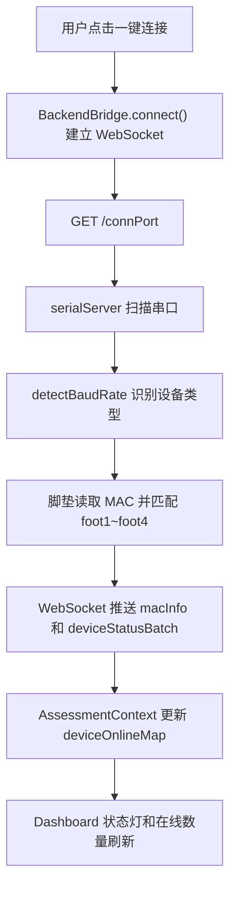
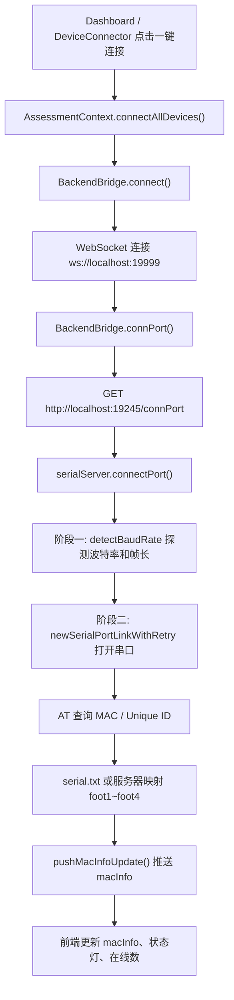

# 老年人筛查系统功能系统架构文档

**最后更新**: 2026-05-07

本文档按“用户实际操作链路”梳理系统功能。后续做优化时优先在对应场景下补充：入口文件、调用链路、输入输出、异常处理和影响范围。

## 1. 功能主线总览

| 主线 | 用户场景 | 前端入口 | 后端/服务入口 | 核心处理 |
|---|---|---|---|---|
| 应用启动 | 用户打开桌面端 | `back-end/code/index.js` 加载前端窗口 | `server/serialServer.js`、Python AI 服务 | 创建 Electron 窗口，启动 Node 后端和 Python 服务，加载静态前端或 Vite 开发服务。 |
| 登录与配置 | 输入机构、设备映射、AI key | `Login.jsx`、`AssessmentContext.jsx` | `/serialCache`、`/bindKey`、Python AI 配置 | 缓存机构信息、设备 MAC 映射和大模型 API key，兼容多路径 `serial.txt`。 |
| 一键连接 | 连接全部传感器 | `Dashboard.jsx`、`DeviceConnector.jsx` | `/connPort`、WebSocket `19999` | 扫描串口、探测波特率、识别设备、推送 MAC 信息和在线状态。 |
| 评估采集 | 握力/起坐/站立/步态 | `pages/assessment/*.jsx` | `/setActiveMode`、`/startCol`、`/endCol` | 设置采样模式，实时接收数据，采集帧写入 SQLite。 |
| 报告生成 | 采集结束后查看结果 | 各报告组件 | `/getHandPdf`、`/getSitAndFootPdf`、`/getDbHeatmap`、`/getFootPdf` | 从数据库取帧，调用 JS/Python 算法，返回 `render_data`。 |
| 历史记录 | 查看、搜索、删除既往评估 | `AssessmentHistory.jsx`、`HistoryReportView.jsx` | 前端 `localStorage` + `/api/history/*` 兼容接口 | 按会话保存四类评估结果，支持查看综合报告和单项报告。 |
| 导出与更新 | PDF 导出、CSV、自动更新 | `pdfExport.jsx`、`UpdateNotification.jsx` | `/exportCsv`、`electron-updater` | 前端生成 PDF，后端导出采集 CSV，Electron 检查并安装新版本。 |

## 2. 应用启动流程

1. 用户启动 Electron 应用，`back-end/code/index.js` 进入主进程。
2. 主进程判断当前是否为打包模式。
3. 未打包模式下，如果存在 `renderer-build/index.html`，优先加载本地静态构建；只有设置 `FORCE_VITE_DEV_SERVER=1` 时才连接 Vite 开发服务器。
4. 主进程启动 `serialServer.js` 作为独立 Node 子进程，提供 HTTP `19245` 和 WebSocket `19999` 服务。
5. 主进程启动 Python AI/FastAPI 服务，用于 AI 报告生成和算法扩展。
6. `preload.js` 通过 `contextBridge` 暴露更新相关 IPC，前端通过 `window.electronAPI` 调用自动更新能力。
7. 退出应用时，主进程在 `before-quit` / `will-quit` 中清理子进程，避免端口和串口被占用。

| 场景 | 处理策略 | 关键点 |
|---|---|---|
| 本地没有 Vite 服务 | 自动回退到静态构建 | 避免 `localhost:5173` 连接失败导致白屏。 |
| 打包运行 | 从 `resources` 加载前端和 Python runtime | 避免依赖用户机器安装 Node/Python。 |
| 开发调试 | 默认打开 DevTools，窗口最大化 | 生产环境默认不打开，需 `OPEN_DEVTOOLS=1`。 |
| Python 服务启动失败 | 前端 AI 功能降级并给出错误 | 基础评估采集和本地报告仍应尽量可用。 |

## 3. 登录、机构配置与设备映射

登录页承载三类配置：机构名称、设备映射、大模型 API key。当前 `serial.txt` 同时兼容登录缓存和脚垫 MAC 映射，维护时需要避免互相覆盖。

| 步骤 | 做了什么 | 相关文件/接口 |
|---|---|---|
| 读取配置 | 前端进入登录页后读取后端 `/serialCache`，获得机构、密钥、设备映射和实际命中的配置路径。 | `Login.jsx`、`serialServer.js` |
| 编辑配置 | 用户填写机构、API key、设备映射。设备映射推荐格式为 `MAC:foot1,MAC:foot2,MAC:foot3,MAC:foot4`。 | `Login.jsx` |
| 保存配置 | `/serialCache` 合并写回多个可写候选路径，保留已有 MAC 映射字段。 | `writeSerialCache` |
| 登录态落地 | `AssessmentContext.login()` 保存登录状态，并调用 `setRuntimeLlmApiKey()` 更新运行时 AI key。 | `AssessmentContext.jsx`、`gripPythonApi.js` |

| 场景 | 处理策略 |
|---|---|
| 新装首次启动没有用户目录 `serial.txt` | 后端将包内种子文件复制到用户目录，后续读写用户目录。 |
| 更新安装包后配置丢失风险 | 打包模式只把用户可变配置放到 `userData`，避免安装目录更新覆盖用户配置。 |
| 旧版本把映射写在 `key` 字段 | 后端继续兼容旧格式，但新保存时按新结构写入。 |
| 设备回传 MAC 带分隔符或前缀 | 归一化 `Unique ID` / `MAC Address` / `0x...`，去除空格、冒号、短横线后匹配。 |

## 4. 设备连接、状态灯与重连

设备连接由 `AssessmentContext.connectAllDevices()` 统一发起，`BackendBridge` 是前端唯一通信入口。



| 设备 | 波特率 | 数据帧 | 前端事件 | 场景 |
|---|---:|---|---|---|
| 左/右手套 HL/HR | `921600` | 130/146 字节分包，前端归一为 256 点 | `leftHandData`、`rightHandData` | 握力评估。 |
| 坐垫 sit | `1000000` | 1024 点，32×32 | `sitData` | 起坐评估。 |
| 脚垫 foot1~foot4 | `3000000` | 4096 点，64×64 | `foot1Data` ~ `foot4Data` | 起坐、站立、步态。 |

| 场景 | 处理策略 | 注意事项 |
|---|---|---|
| 正常连接 | 先 WebSocket，后 `/connPort`，确保连接期间的 `macInfo` 不丢。 | 不要绕过 `AssessmentContext.connectAllDevices()`。 |
| 设备掉线 | `deviceStatusBatch` 每帧推送完整 7 设备快照，前端直接替换 `deviceOnlineMap`。 | 避免逐个合并导致在线数和状态灯不一致。 |
| 短暂卡顿误报离线 | 前端离线提示有 5 秒防抖。 | 报告计算阻塞时不要立即弹断开提示。 |
| 重新扫描 | `rescanDevices()` 清空前端状态，再调用 `/rescanPort`。 | 已断开串口关闭异常要被后端吞掉并继续扫描。 |
| 点击“已连接”断开 | `/disconnectAll` 关闭全部串口、清空后端运行态，再断开 WebSocket。 | 需要重置 `MaxHZ`、`gloveLatestData`、`deviceOnline` 等缓存。 |
| macOS CH340 端口锁 | 连接流程分为“探测”和“正式连接”两阶段，中间延时释放端口锁。 | 不要在探测阶段长期持有串口。 |

### 4.1. 一键连接、线序处理与数据分发模块

这一块是实时数据链路的核心：前端只点一次“一键连接”，后端完成串口扫描、设备识别、脚垫线序映射、数据方向修正、滤波、分发；前端再按评估页面把同一批事件转换成 UI、统计和报告采集所需的数据结构。

#### 4.1.1. 一键连接调用链



| 步骤 | 后端处理 | 目的 |
|---|---|---|
| 枚举串口 | `SerialPort.list()` 后通过 `getPort()` 过滤可用端口。 | 找到当前机器上的传感器串口。 |
| 阶段一探测 | `detectBaudRate(path)` 依次尝试 `921600`、`1000000`、`3000000`。 | 不依赖串口名或 CH340 标记，直接用真实数据判断设备类型。 |
| 双重校验 | 先找分隔符 `AA 55 03 99`，再验证帧长是否匹配。 | 防止脚垫、坐垫、手套被误识别。 |
| 阶段二连接 | 全部探测完成后等待 1 秒，再逐个 `newSerialPortLinkWithRetry()` 打开。 | 规避 macOS / CH340 端口锁。 |
| 设备大类识别 | `BAUD_DEVICE_MAP`: `921600=hand`、`1000000=sit`、`3000000=foot`。 | 先确定大类，再细分具体设备。 |
| 设备细分 | 手套按帧内 `sensorType` 分 HL/HR；脚垫按 MAC 映射分 foot1~foot4。 | 建立“物理串口 -> 业务设备”的稳定关系。 |
| 状态推送 | `pushMacInfoUpdate()` 通过 WebSocket 发 `{ macInfo }`。 | 前端展示设备识别结果、映射来源和授权状态。 |

#### 4.1.2. 脚垫线序和设备编号处理

这里的“线序”主要分两层：一是四块脚垫的编号线序，二是单块 64×64 矩阵内部方向。

| 层级 | 处理位置 | 当前规则 |
|---|---|---|
| 脚垫编号线序 | `serial.txt` + `findTypeFromSerialCache(uniqueId)` | 通过 MAC/Unique ID 把实际串口映射成 `foot1`、`foot2`、`foot3`、`foot4`。 |
| MAC 归一化 | `normalizeSerialIdentifier()` | 去掉冒号、短横线、空格、`Unique ID=`、`MAC Address:`、`0x...` 等格式差异后匹配。 |
| 映射来源标记 | `syncMacInfoType()` | `macInfo[path]` 携带 `typeSource`、`matchStrategy`、`serialPath`、`serialKey`，用于排查线序来源。 |
| 起坐/站立主脚垫 | `MODE_TYPE_MAP` | `mode=3`、`mode=4` 都只使用 `foot4`。这是当前业务约定，前端也按 `foot4Data` 监听。 |
| 步态四路脚垫 | `MODE_TYPE_MAP` | `mode=5` 使用 `foot1~foot4`。前端步态页分别监听四个事件。 |
| 未映射脚垫 | `dataItem.type='foot'` 后兜底 | `parseData()` 会把 `foot` 兜底改成 `foot4`，保证单脚垫场景可继续显示。 |

维护注意：

1. 如果现场发现 foot1~foot4 物理摆放和页面位置不一致，优先检查 `serial.txt` 的 MAC 映射，而不是直接改前端渲染顺序。
2. 如果要调整起坐/站立使用哪块脚垫，需要同时改 `MODE_TYPE_MAP`、前端监听事件和报告查询逻辑，当前约定是 `foot4`。
3. `macInfo` 里的 `serialPath` 和 `serialKey` 是排查“设备识别到了但线序不对”的第一现场信息。

#### 4.1.3. 后端数据源头处理

串口收到数据后，`DelimiterParser` 按分隔符拆帧，`parser.on("data")` 根据帧长进入不同处理分支。

| 帧长 | 设备/含义 | 后端处理 | 输出数据 |
|---:|---|---|---|
| `18` | 独立 IMU | `bytes4ToInt10()` 解析旋转数据。 | `dataItem.rotate` |
| `130` | 手套 Packet1 | 读取 `orderByte`、`sensorType`，缓存前 128 字节，不更新 `dataItem.type/arr`。 | `glovePacket1Cache[sensorType]` |
| `146` | 手套 Packet2 + IMU | 与 Packet1 合并为 256 字节；若 Packet1 丢失，则接受 128 字节；写入 `gloveLatestData.HL/HR`。 | `HL/HR.arr`、`rotate`、`stamp` |
| `1024` | 坐垫 sit | `hand(pointArr)` 转换 32×32 数据，计算时间戳和 HZ。 | `sit.arr` |
| `4096` | 脚垫 foot | 先做线序/方向处理，再按模式滤波和坏线补值。 | `foot1~foot4.arr` 或 `foot4.arr` |

脚垫 4096 帧的源头处理顺序：

1. `shiftFoot64x64FirstRowToLast()`：把第一行移到最后一行，修正硬件行序偏移。
2. `activeSampleType === '3' || '4'`：起坐和静态站立先做 `flipFoot64x64Vertical()`，再做 `flipFoot64x64Horizontal()`。
3. `activeSampleType === '5'`：步态模式做 `flipFoot64x64Vertical()`。
4. 根据 `activeSampleType` 选择滤波模式：`4 -> standing`，`5 -> gait`，兜底按 `dataItem.type` 推断。
5. `applyFootFilter()`：根据配置执行阈值去噪、小连通域移除；静态模式还可以做坏线补值，步态坏线补值留给前端合并后处理。

#### 4.1.4. 后端分发结构

后端不直接把端口路径发给前端，而是通过 `parseData()` 把 `dataMap[path]` 转换成业务设备类型，再通过 `sendData()` 按类型拆包推送。

```json
{
  "data": {
    "HL": { "status": "online", "arr": [256], "rotate": [], "stamp": 0, "HZ": 0 },
    "HR": { "status": "online", "arr": [256], "rotate": [], "stamp": 0, "HZ": 0 }
  },
  "sitData": {
    "sit": { "status": "online", "arr": [1024], "stamp": 0, "HZ": 0 },
    "foot4": { "status": "online", "arr": [4096], "stamp": 0, "HZ": 0 }
  }
}
```

| 函数 | 做了什么 |
|---|---|
| `parseData(parserArr, dataMap)` | 检查端口是否打开、数据是否 5 秒内新鲜，把数据整理成 `{ HL, HR, sit, foot1... }`。 |
| `gloveLatestData` | 手套不直接从 `dataMap` 取，因为左右手共用串口，必须按 HL/HR 独立缓存，避免 type 和 arr 错配。 |
| `filterDataByTypes(obj, activeSendTypes)` | 按当前评估模式只保留需要的设备，降低前端处理压力。 |
| `sendData()` | 手套放到 `payload.data`，坐垫/脚垫放到 `payload.sitData`，统一 WebSocket 广播。 |
| `colAndSendData()` | 定时调用 `sendData()`；采集状态 `colFlag=true` 时同时写入 SQLite。 |
| `setActiveSendTypes()` | 根据评估模式重建推送定时器；Dashboard 全设备模式默认 80ms 推送。 |

`MODE_TYPE_MAP` 当前关系：

| mode | 场景 | 后端推送设备 |
|---:|---|---|
| `1` | 握力页面显示 | `HL`、`HR` |
| `11` | 左手握力采集 | `HL` |
| `12` | 右手握力采集 | `HR` |
| `3` | 起坐评估 | `sit`、`foot4` |
| `4` | 静态站立 | `foot4` |
| `5` | 步态评估 | `foot1`、`foot2`、`foot3`、`foot4` |

#### 4.1.5. 前端数据入口和分发

`BackendBridge.js` 是前端唯一后端数据入口。它不直接渲染 UI，只负责把 WebSocket 消息拆成前端事件。

| 输入 | BackendBridge 处理 | 对外事件 |
|---|---|---|
| `msg.data.HL/HR` | `_processGloveData()`，128 字节会 `_normalizeGloveArr()` 补零到 256。 | `leftHandData`、`rightHandData` |
| `msg.sitData.foot1~foot4` | `_processHighHZData()`，原样转发 4096 一维数组。 | `foot1Data`、`foot2Data`、`foot3Data`、`foot4Data` |
| `msg.sitData.sit` | `_processHighHZData()`，原样转发 1024 一维数组。 | `sitData` |
| 任意设备状态 | 收集本帧状态后 `_batchUpdateDeviceStatus()`。 | `deviceStatusBatch` |
| `msg.macInfo` | 直接转发。 | `macInfo` |

`AssessmentContext.jsx` 负责全局状态：

| 状态 | 来源 | 用途 |
|---|---|---|
| `deviceConnStatus` | 一键连接结果 | 控制“一键连接/已连接/error”主状态。 |
| `deviceOnlineMap` | `deviceStatusBatch` | Dashboard 状态灯、在线数量、评估入口设备状态。 |
| `macInfo` | `macInfo` 事件 | 展示设备 MAC、型号、映射来源，辅助排查线序。 |
| `deviceAlerts` | 离线防抖逻辑 | 设备从 online 连续 5 秒 offline 后弹提示。 |

#### 4.1.6. 前端各评估模块的数据处理

| 前端模块 | 监听事件 | 做的数据处理 | 输出到哪里 |
|---|---|---|---|
| `GripAssessment.jsx` | `leftHandData`、`rightHandData` | `mapLeftHand()` / `mapRightHand()` 映射到手部热力图；计算平均压力、最大值、统计曲线；采集时保存完整帧。 | 手部 3D 热力图、左侧实时曲线、握力报告采集缓存。 |
| `usePressureScene.js` | `sitData` | 1024 flat -> 32×32；`flipLR()`；`denoiseMatrix()`；计算 `matrixStats()` 和 `calculateCoP()`。 | 起坐 3D 坐垫、坐垫 COP、坐垫统计。 |
| `usePressureScene.js` | `foot1Data~foot4Data` | 按模式过滤脚垫；`combineFootpads()` 合并；`rotateCCW90()`；起坐模式额外 `flipLR()`；去噪并计算 COP。 | 起坐/步态 3D 脚垫场景、足底统计。 |
| `StandingAssessment.jsx` | `foot4Data` | 保存原始 flat；`FootAnalysis.parseFrameData()` 转 64×64、旋转、上下/左右翻转、去噪。 | 静态站立实时足底图、COP 轨迹、采集帧。 |
| `GaitAssessment.jsx` | `foot1Data~foot4Data` | 每块 4096 flat -> 64×64；再转置，与 `FootpadSerialService` 的方向保持一致；计算四块脚垫压力和步态事件。 | 步态实时步道、左侧压力统计、步态报告采集。 |
| `HeatmapCanvas` / `heatmap.js` | 评估页转换后的矩阵 | 预分配缓冲、归一化、模糊、纹理更新。 | 手部/足底热力图材质。 |

脚垫合并规则在 `usePressureScene.combineFootpads()`：

| 脚垫 | 合并矩阵位置 |
|---|---|
| `foot1` | 左上 |
| `foot2` | 右上 |
| `foot3` | 左下 |
| `foot4` | 右下 |

#### 4.1.7. 这块后续优化时优先检查的点

| 问题现象 | 优先检查 |
|---|---|
| 点一键连接后某个设备一直灰 | `/connPort` 返回、`macInfo.typeSource`、`deviceStatusBatch` 是否包含该设备。 |
| foot1~foot4 顺序不对 | `serial.txt` MAC 映射、`macInfo.serialKey`、`MODE_TYPE_MAP`、前端 `combineFootpads()` 位置。 |
| 起坐/站立画面左右或上下反 | 后端 4096 帧方向处理、`activeSampleType` 是否正确、前端 `parseFrameData()` / `usePressureScene` 是否重复翻转。 |
| 步态四块脚垫方向不一致 | 后端步态模式 `flipFoot64x64Vertical()`、前端 `GaitAssessment` 转置逻辑、`GaitCanvas` 坏线补值和合并逻辑。 |
| 手套右手无数据或清零失败 | Packet1/Packet2 日志、`gloveLatestData.HR` 是否有 128 字节、`_normalizeGloveArr()` 是否补零。 |
| 状态灯在线数和设备灯不一致 | `BackendBridge._batchUpdateDeviceStatus()`、`AssessmentContext` 是否直接替换 `deviceOnlineMap`。 |
| 报告查不到数据 | `setActiveMode()` 的 `activeSampleType`、`startCol()` 的 `assessmentId/sampleType`、`colAndSendData()` 是否进入 `storageData()`。 |

## 5. 评估采集统一六步法

四个评估页面必须遵循同一套数据传递规范，避免报告查不到采集数据或历史记录无法回放。

| 步骤 | 前端动作 | 后端动作 | 结果 |
|---|---|---|---|
| 1. 设置模式 | `backendBridge.setActiveMode(mode)` | 设置 `activeSampleType` 和活跃推送类型 | 后续采集写入正确 `sample_type`。 |
| 2. 开始采集 | `backendBridge.startCol({ name, assessmentId, date, colName })` | 初始化采集状态和数据库写入上下文 | 串口帧进入当前评估缓冲区。 |
| 3. 实时展示 | 监听 `BackendBridge` 事件 | WebSocket 广播实时矩阵 | 3D 场景、热力图、ECharts 更新。 |
| 4. 结束采集 | `backendBridge.endCol()` | 停止采集并 flush 到 SQLite | 数据落入 `matrix` 表。 |
| 5. 生成报告 | 调用对应 `getXxxReport()` | 查询数据库，调 JS/Python 算法 | 返回统一结构 `{ code, data: { render_data } }`。 |
| 6. 渲染与保存 | `setPythonResult()`、`completeAssessment()` | 前端历史服务保存会话 | 页面进入报告态，Dashboard 可查看完成状态。 |

| 模式 | `mode` | `sample_type` | 激活设备 | 报告接口 |
|---|---:|---:|---|---|
| 握力 | `1`，单手时可切 `11`/`12` | `1` | HL/HR | `POST /getHandPdf` |
| 起坐 | `3` | `3` | sit + foot1 | `POST /getSitAndFootPdf` |
| 静态站立 | `4` | `4` | foot1 | `POST /getDbHeatmap` |
| 步态 | `5` | `5` | foot1~foot4 | `POST /getFootPdf` |

维护规则：

1. `assessmentId` 使用 `{type}_{Date.now()}`，同一次采集的开始、结束、报告参数必须一致。
2. 调报告前保留短暂等待，确保 `/endCol` 后数据库写入完成。
3. 报告组件只接受真实 `render_data`，无数据时显示“暂无报告数据”。
4. `completeAssessment(type, report, data, assessmentId)` 是 Dashboard 完成状态和历史保存的统一入口。

## 6. 四类评估场景

### 6.1. 握力评估

| 阶段 | 做了什么 | 处理场景 |
|---|---|---|
| 进入页面 | 设置手套模式，清理旧基线，准备左右手实时曲线和 3D 手部热力图。 | 用户从 Dashboard 进入或从历史查看报告。 |
| 清零 | 调 `/tareGrip`，读取 `gloveLatestData` 中 HL/HR 最新帧作为基线。 | 支持左右手共用串口；右手 128 字节半帧也可清零。 |
| 采集 | 单手或双手分别生成 assessmentId，调用 `/startCol` 记录采集。 | 左手、右手、双手三种操作路径。 |
| 实时展示 | `leftHandData` / `rightHandData` 更新压力曲线、统计数据、正态分布和热力图。 | 设备连接后即实时变化，不依赖采集开始。 |
| 结束与报告 | `/endCol` 后调用 `/getHandPdf`，传入左右手 assessmentId。 | 单手报告允许另一侧为空；双手报告合并展示。 |
| 异常处理 | 清零失败自动重试；旧数据超过新鲜度窗口时拒绝作为基线。 | 第二次进入页面、右手 Packet1 丢失、串口数据交替覆盖。 |

### 6.2. 起坐评估

| 阶段 | 做了什么 | 处理场景 |
|---|---|---|
| 进入页面 | 提示用户完成 5 次起坐，设置起坐模式。 | 需要 sit + foot1 同时在线。 |
| 采集 | `/startCol` 使用 `sample_type=3`，记录坐垫和脚垫帧。 | 同一评估内同步分析坐姿压力和足底压力。 |
| 实时展示 | 坐垫 32×32 和脚垫 64×64 进入力时间曲线、COP 和 3D 场景。 | 已修复跨模式 footBuffers 污染。 |
| 结束与报告 | `/getSitAndFootPdf` 生成 `duration_stats`、`force_curves`、`heatmap_data`、`cop_data`。 | 报告展示周期、峰值、左右压力、坐垫/脚垫对比。 |
| 异常处理 | 去除重复帧并使用真实时间戳计算帧率。 | 避免采样率异常影响周期判断。 |

### 6.3. 静态站立评估

| 阶段 | 做了什么 | 处理场景 |
|---|---|---|
| 进入页面 | 设置站立模式，写入站立脚垫滤波参数。 | 默认 `filterThreshold=10`、`filterMinArea=8`。 |
| 操作提示 | 提示用户踩上脚垫，约 10 秒后结束。 | 单脚垫 foot1 站立评估。 |
| 采集 | `/startCol` 使用 `sample_type=4`，保存 foot1 64×64 帧。 | 后端执行阈值过滤、小岛移除、方向翻转。 |
| 实时展示 | 前端 `FootAnalysis.js` 做矩阵方向转换和左右脚拆分。 | 3D 场景和 COP 图动态更新。 |
| 结束与报告 | `/getDbHeatmap` 调用站立算法，返回足弓、足底分区、COP 轨迹和置信椭圆。 | 报告综合评估、左右压力比、椭圆面积。 |
| 异常处理 | COP 轨迹为空时以算法输出为准；无真实数据时不展示假报告。 | 已修复硬编码 50/50 和椭圆宽高为 0。 |

### 6.4. 步态评估

| 阶段 | 做了什么 | 处理场景 |
|---|---|---|
| 进入页面 | 设置步态模式，写入步道滤波和优化参数。 | 默认 `filterThreshold=15`、`filterMinArea=12`。 |
| 采集 | `/startCol` 使用 `sample_type=5`，采集 foot1~foot4。 | 四路脚垫组成步道。 |
| 实时展示 | `GaitCanvas`、`GaitVisualizations` 展示脚印、压力分区、步态趋势。 | 支持脚垫方向校正和 3D 缩放。 |
| 结束与报告 | `/getFootPdf` 生成步长、步宽、速度、足偏角、支撑相等参数。 | 支持按体重参数计算更贴近真实负荷的指标。 |
| 异常处理 | `cycle_start` 为 `None` 时算法需要跳过或兜底。 | 避免步态周期识别失败导致报告崩溃。 |

## 7. 报告数据结构和历史记录

报告接口统一返回：

```json
{
  "code": 0,
  "data": {
    "timestamp": 1700000000000,
    "render_data": {}
  },
  "msg": "success"
}
```

前端保存历史时，以一次完整筛查会话为单位，而不是每个单项单独建档。

| 数据层 | 存储位置 | 内容 | 处理策略 |
|---|---|---|---|
| 实时帧 | `back-end/code/db/foot.db` 的 `matrix` 表 | 原始矩阵、时间戳、患者名、assessmentId、sample_type | 用于报告生成、CSV 导出、回放。 |
| 页面状态 | `AssessmentContext.assessments` | 四类评估完成状态、报告数据、assessmentId | Dashboard 和当前会话共享。 |
| 历史记录 | `localStorage:sarcopenia_assessment_history` | 患者信息、机构、四类评估报告、完成时间 | 最多保留 200 条完整评估会话。 |
| 兼容接口 | `/api/history/*` | 后端历史 CRUD 兼容路径 | 保留给旧流程或自动化测试。 |

`saveAssessmentSession()` 使用 `sessionId` 更新同一会话，避免同名患者同日多次评估互相覆盖。每次 `completeAssessment()` 后，已完成的单项会写入同一条历史记录。

## 8. 导出、AI 报告与自动更新

| 功能 | 流程 | 场景处理 |
|---|---|---|
| 单报告 PDF | 前端报告 DOM 通过 `html2canvas` 截图，再用 `jsPDF` 生成 PDF。 | 适合导出当前单项报告。 |
| 综合报告 PDF | `ComprehensiveReport.jsx` 汇总四项报告，再复用 PDF 导出。 | 已完成的项目显示真实报告，未完成项目不伪造数据。 |
| CSV 导出 | 后端 `/exportCsv` 从数据库读取采集帧并生成 CSV。 | 用于算法复核、现场数据备份。 |
| AI 解读 | 前端传报告数据给 Python AI/FastAPI 或本地封装 API。 | `/pyapi` 代理失效时回退直连 `127.0.0.1:8765`。 |
| 自动更新 | `electron-updater` 检查 `latest.yml`，前端显示进度和 release notes。 | 打包后使用 `http://sensor.bodyta.com/evaluate`。 |

## 9. 异常处理清单

| 异常 | 判断位置 | 当前处理 |
|---|---|---|
| 后端 HTTP 不通 | `BackendBridge` fetch 抛错 | 前端捕获并展示失败信息，设备状态置为 error。 |
| WebSocket 断开 | `BackendBridge.ws.onclose` | 3 秒后自动重连；手动断开时关闭重连定时器。 |
| 设备短暂离线 | `AssessmentContext._handleDeviceStatusChange` | 5 秒防抖后才弹设备断开提示。 |
| 串口无法打开 | `newSerialPortLinkWithRetry` / `/connPort` | 最多重试，失败设备不阻塞其他设备连接。 |
| 报告无 `render_data` | 各评估页报告生成 catch | 抛出“后端未返回报告数据”，停止分析态。 |
| 请求体过大 | `express.json({ limit: '200mb' })` | 允许较大报告/历史数据，但前端仍应避免保存原始巨量帧到历史。 |
| 数据库 schema 缺列 | `ensureMatrixNameColumn` 等启动检查 | 自动补齐 `timestamp`、`select` 等关键列。 |
| Python 依赖缺失 | Electron 启动脚本 / Python 服务日志 | 使用 `requirements-electron.txt` 作为桌面端依赖入口。 |

## 10. 后续优化记录规范

后续每次优化建议按以下格式补到对应场景，避免只写“修复了什么”而丢失上下文：

| 字段 | 说明 |
|---|---|
| 场景 | 用户在哪一步遇到问题，例如“一键连接后 foot2 灰灯”。 |
| 入口 | 前端页面、后端 API、WebSocket 事件或算法脚本。 |
| 输入 | 用户操作、接口参数、设备帧、数据库记录。 |
| 处理 | 关键分支、状态变化、缓存读写、算法调用。 |
| 输出 | UI 状态、接口响应、报告字段、历史记录。 |
| 异常 | 失败条件、兜底策略、用户提示。 |
| 验证 | 用例、日志、现场复现步骤或测试命令。 |
