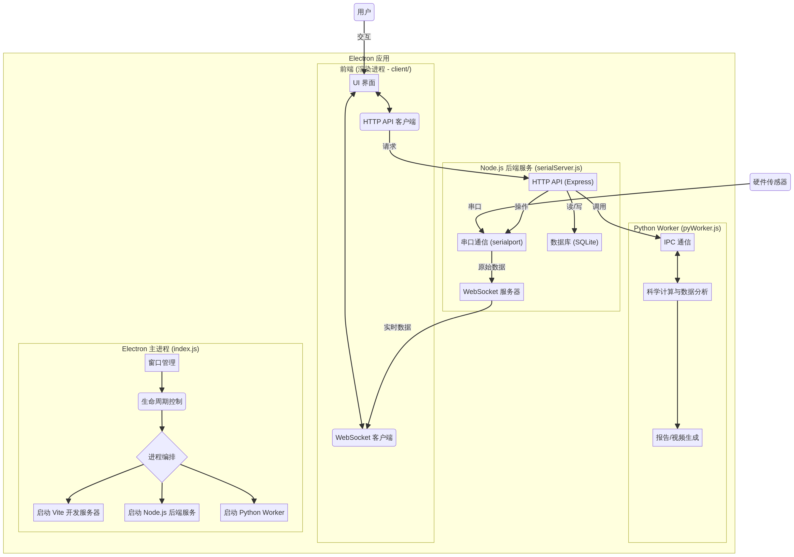

# Electron 项目代码分析文档

## 1. 项目概述

本文档旨在对提供的 Electron 项目代码进行深入分析，阐明其项目架构、技术栈、核心功能模块、业务逻辑以及数据流程。该项目是一个复杂的数据采集与分析应用，主要用于连接多种生物力学传感器（如压力鞋垫、握力计、坐垫等），进行实时数据采集、存储、回放、分析，并最终生成专业的评估报告。

应用的核心功能围绕着从硬件设备通过串口获取原始数据，经过 Node.js 后端服务的处理与分发，由 Python 子进程进行复杂的科学计算和数据分析，最终通过 Electron 渲染的 Web 前端界面进行实时可视化展示和交互操作。

## 2. 项目架构

该应用采用了一个典型的混合架构，将 Electron 作为外壳，内部集成了基于 Node.js 的主进程、一个独立的 Node.js 后端服务、一个 Python 数据处理服务以及一个 Web 前端应用。

### 2.1. 架构图

### 2.2. 模块职责

| 模块 | 主要文件 | 核心职责 |
| :--- | :--- | :--- |
| **Electron 主进程** | `index.js`, `preload.js` | - 创建和管理应用窗口。 - 编排和管理后端服务子进程的生命周期。 - 在开发模式下启动 Vite 服务器。 - 通过 `preload.js` 向渲染进程暴露安全的 Node.js API。 |
| **Node.js 后端服务** | `server/serialServer.js` | - 提供完整的 HTTP RESTful API 用于数据查询、设备控制、历史记录管理等。 - 建立 WebSocket 服务，向前端实时推送传感器数据。 - 通过 `serialport` 库连接硬件设备，处理串口通信和原始数据解析。 - 使用 `sqlite3` 库将采集的数据持久化到本地数据库。 |
| **Python Worker** | `pyWorker.js`, `python/app/server.py` | - `pyWorker.js` 负责创建和管理 Python 子进程，并通过标准输入输出（stdin/stdout）进行 JSON-RPC 通信。 - `python/app/server.py` 作为 Python 服务的入口，接收 Node.js 的调用，执行 CPU 密集型的数据分析、科学计算和报告生成任务。 |
| **前端 (渲染进程)** | `client/` (推断) | - 构建用户交互界面，可能使用 React 框架。 - 通过 WebSocket 接收实时数据并进行可视化展示（如热力图、曲线图）。 - 通过 HTTP API 与后端服务交互，执行用户操作（如开始/停止采集、查询历史等）。 |

## 3. 技术栈

| 分类 | 技术 | 主要用途 |
| :--- | :--- | :--- |
| **核心框架** | Electron | 构建跨平台的桌面应用程序。 |
| **后端 (Node.js)** | Express.js, `ws` (WebSocket), `serialport`, `sqlite3`, `multer` | API 服务、实时通信、串口硬件交互、数据存储、文件上传。 |
| **后端 (Python)** | NumPy, SciPy, OpenCV-Python | 科学计算、信号处理、图像处理、视频生成。 |
| **前端** | Vite, React (推断) | 构建现代化的、响应式的用户界面。 |
| **构建与打包** | `electron-builder` | 将应用打包成 Windows (`.nsis`) 和 macOS (`.dmg`) 安装程序。 |
| **辅助工具** | `crypto-js`, `systeminformation` | 数据加解密、获取系统硬件信息。 |

## 4. 核心模块分析

### 4.1. Electron 主进程 (`index.js`)

主进程是整个应用的入口和指挥中心。其主要职责包括：

- **环境判断**: 通过 `app.isPackaged` 判断应用是处于开发环境还是生产环境，并据此决定加载前端资源的路径（本地 Vite 服务器或打包后的静态文件）和 Python 脚本的路径。
- **窗口创建**: 使用 `BrowserWindow` 创建应用的主窗口，并加载前端页面。窗口默认全屏显示。
- **进程管理**: 这是 `index.js` 最核心的功能。它通过 `fork` 和 `spawn` 启动了两个关键的后台服务：
    1.  **`serialServer.js`**: 使用 `fork` 启动一个独立的 Node.js 进程，负责所有与硬件通信、数据处理和 API 服务相关的任务。主进程通过 IPC 消息（`process.send`）来确认该服务是否已就绪。
    2.  **`pyWorker.js`**: 调用 `startWorker()` 函数，该函数内部使用 `spawn` 启动一个 Python 解释器，运行 `python/app/server.py` 脚本。这个 Python 进程作为常驻服务，用于处理计算密集型任务。
- **开发服务器**: 在开发模式下，它会尝试启动 Vite 开发服务器，并等待其可用，然后加载对应的 URL，以实现前端热更新。
- **硬件指纹**: 在应用启动时，通过 `getHardwareFingerprint` 获取设备的唯一标识符（UUID），并尝试从服务器获取一个与之关联的密钥，这表明应用可能包含授权或激活机制。

### 4.2. Node.js 后端服务 (`server/serialServer.js`)

这是整个应用最复杂的部分，相当于一个内嵌的微服务，为前端和主进程提供全面的后端支持。

- **HTTP API (Express)**: 监听在 `19245` 端口，提供了数十个 API 接口，覆盖了应用的全部功能。这些接口遵循 RESTful 风格，使用统一的 `HttpResult` 格式返回数据。主要功能包括：
    - **设备管理**: 扫描和连接串口（`/getPort`, `/connPort`），切换设备模式（`/setActiveMode`）。
    - **数据采集**: 开始/停止数据采集（`/startCol`, `/endCol`），并将数据存入 SQLite 数据库。
    - **历史数据**: 查询采集历史列表（`/getColHistory`），获取某次采集的详细数据（`/getDbHistory`），数据回放控制（`/getDbHistoryPlay`, `/changeDbplaySpeed`）。
    - **数据导出与删除**: 将数据导出为 CSV 文件（`/downlaod`），删除指定记录（`/delete`）。
    - **报告生成**: 触发 Python 后端生成各类 PDF 报告和分析视频，例如通过 `/getDbHeatmap` 准备数据，再由 `/uploadCanvas` 结合前端上传的图像生成最终报告。
    - **配置管理**: 提供对本地加密配置和 Python 脚本参数的读写接口（`/getSysconfig`, `/getPyConfig`, `/changePy`）。

- **WebSocket 服务**: 监听在 `19999` 端口，用于将从串口实时接收并解析好的传感器数据推送给前端。前端可以通过 WebSocket 消息来指定需要接收的数据类型（`activeTypes`），实现了动态数据订阅。

- **串口通信**: 使用 `serialport` 库，能够自动检测并连接 CH340 芯片的串口设备。它通过一个特定的字节序列 `[0xaa, 0x55, 0x03, 0x99]` 作为数据帧的分隔符来解析串口数据流。根据接收到的数据包长度和内容，它可以识别不同类型的传感器（如握力计、脚踏板、坐垫等）并进行相应的数据处理。

- **数据库交互 (`util/db.js`)**: 所有采集的传感器数据都被存储在 SQLite 数据库中。核心数据表是 `matrix`，它存储了每一次采样的数据帧（JSON 格式）、时间戳、采集名称、评估 ID 等信息。`db.js` 封装了数据库的初始化、数据增删改查、以及将数据导出为 CSV 的所有逻辑。

### 4.3. Python Worker (`pyWorker.js` 和 `python/app/server.py`)

为了避免 Node.js 在执行大规模科学计算时阻塞事件循环，项目将所有复杂的计算任务都委托给了一个 Python 子进程。

- **IPC 通信 (`pyWorker.js`)**: 这个文件实现了一个健壮的、基于 Promise 的 JSON-RPC 机制。`callPy(fn, args)` 函数将要调用的 Python 函数名和参数打包成 JSON 字符串，通过子进程的 `stdin` 发送给 Python。同时，它监听 `stdout`，解析 Python 返回的 JSON 结果，并通过 Promise 的 `resolve` 或 `reject` 将结果或错误返回给调用者。该模块还包含了自动重启、超时处理和错误捕获等健壮性设计。

- **Python 计算服务 (`python/app/server.py`)**: 这是 Python 端的服务入口。它在一个循环中监听 `stdin`，读取 JSON 请求，然后根据请求中的 `fn` 字段调用对应的函数。`FUNCS` 字典定义了所有可供 Node.js 调用的函数，包括：
    - `realtime_server`: 实时计算 COP（Center of Pressure）。
    - `replay_server`: 回放模式下的批量计算。
    - `generate_foot_pressure_report`: 生成静态站立姿态的 PDF 报告。
    - `analyze_gait_and_build_report`: 分析步态数据并生成报告。
    - `generate_dashboard_video`: 生成步态分析的视频。
    - `process_glove_data_from_array`: 处理握力数据。
    - 以及其他多种用于生成报告和视频的函数。

## 5. 数据流程

以一次“足底压力”实时采样的典型场景为例，数据流程如下：

1.  **用户操作**: 用户在前端界面点击“开始采集”。
2.  **API 请求**: 前端发送 `POST /startCol` 请求到 `serialServer.js`。
3.  **开始采集**: `serialServer.js` 设置采集标志位 `colFlag = true`。
4.  **硬件数据**: 传感器持续通过串口发送原始数据。
5.  **数据接收与解析**: `serialServer.js` 中的 `serialport` 实例接收数据，并通过分隔符 `[0xaa, 0x55, 0x03, 0x99]` 将数据流切分成数据帧。
6.  **数据初步处理**: 根据数据帧的长度和标识，程序识别出这是足底压力数据（例如，长度为 4096 或 4097 字节），并进行翻转、去噪等预处理。
7.  **实时计算 (Python)**: `serialServer.js` 通过 `callPy('realtime_server', ...)` 将当前数据帧和上一帧数据发送给 Python Worker，计算出实时的 COP（压力中心）等指标。
8.  **数据推送 (WebSocket)**: `serialServer.js` 将预处理后的原始矩阵数据和 Python 计算得到的 COP 数据打包成 JSON 对象，通过 WebSocket (`ws://localhost:19999`) 推送给所有连接的前端客户端。
9.  **前端可视化**: 前端接收到 WebSocket 消息，更新界面上的热力图、COP 轨迹图和各项实时指标。
10. **数据存储 (SQLite)**: 由于采集标志位 `colFlag` 为 `true`，`serialServer.js` 会在每次处理完数据后，调用 `storageData` 函数，将包含原始数据和元信息（时间戳、采集名称等）的 JSON 对象存入 SQLite 数据库的 `matrix` 表中。
11. **停止采集**: 用户点击“停止”，前端发送 `GET /endCol` 请求，`serialServer.js` 将 `colFlag` 设为 `false`，数据存储停止。

## 6. 总结

该项目是一个功能强大且架构设计合理的桌面应用程序。它成功地结合了 Electron、Node.js 和 Python 的优势：

- **Electron** 提供了跨平台的应用外壳和前端渲染能力。
- **Node.js** 以其出色的 I/O 性能和丰富的生态系统，完美地承担了高并发的 API 服务、WebSocket 实时通信和与硬件的底层交互任务。
- **Python** 则发挥了其在科学计算和数据分析领域的传统优势，处理所有复杂的算法和计算密集型任务，并通过进程间通信与主应用解耦。

这种分层和解耦的架构使得项目既能保证用户界面的流畅响应，又能处理复杂的后端逻辑和高性能计算，是构建专业级数据采集分析工具的优秀范例。
